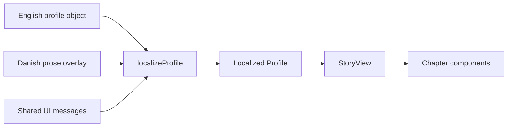

# Current System Architecture

This page describes v1 as deployed and checked on 2026-09-02. The versioned redesign remains [planned](../roadmap.md).

## Runtime and Routes

- Next.js 16 App Router, React 19, TypeScript, Tailwind CSS 4, and Framer Motion 12.
- `/` is locale-selected by `proxy.ts`; the `NEXT_LOCALE` cookie wins over the browser language.
- `/en` and `/da` are catalogs.
- `/[locale]/[slug]` statically generates published profiles and renders the v1 story.
- `/pernille`, `/helle`, and `/shared` profile routes redirect to the separate Pernille/Helle site.
- Vercel deploys from the GitHub repository. No database or server-side DNA processing is part of the public application.

## Profile Data Flow

The current `Profile` type mixes observations, formatted numbers, prose, imagery, colors, and chart values. English is the base object; Danish is a partial overlay. This works for one presentation but makes three future presentations vulnerable to numerical and source drift.

## UI Composition

`StoryView` composes the hero, origins, ancient ancestry, maternal line, paternal line, connections, genome, and notes chapters. Desktop uses a right-side navigation rail; mobile uses a bottom dock and jump dialog.

The v1 visual language is a dark cinematic archive with photographic landscapes, serif display type, small caps, line diagrams, and reveal-on-scroll animation. It is visually coherent, but its long single page repeats explanatory patterns and relies heavily on client-side viewport reveals.

## Data and Deployment Boundary

- Private test exports live under `ftdna/`, which is ignored by Git.
- Public code contains manually curated aggregate facts and narrative copy.
- No raw genotype row or full sequence is needed to build or serve the site.
- First names only; living match names and raw genotypes are forbidden.

The planned architecture keeps these invariants while adding a second boundary: a typed public evidence fixture reproducibly checked against private inputs before release.

## Known Baseline Issues

- `npm run build` passes.
- `npm run lint` currently fails in `Origins.tsx` and `PhoneDock.tsx`.
- Two `<1%` origins are stored internally as `0.5`, inventing chart precision.
- Source citations are text rather than linked records.
- Numerical facts and translated prose share the same presentation-oriented object.
- Reveal components can leave content hidden until client-side viewport intersection occurs.
- The first-load JavaScript for the v1 profile route was approximately 681 KB in the 2026-09-02 production build audit.

See [urgent todo](../urgent-todo.md) for the required corrections.
