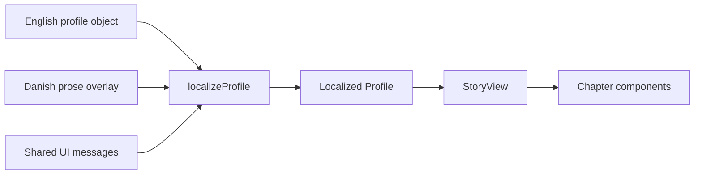
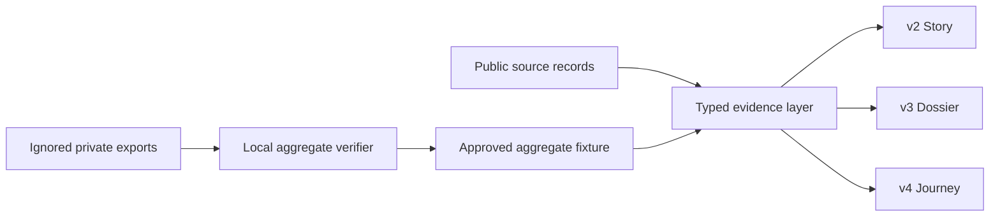

# Current System Architecture

This page describes the production system after the v2-v4 experiments were retired on 2026-09-02. The original v1 route is the active experience.

## Runtime and Routes

- Next.js 16 App Router, React 19, TypeScript, Tailwind CSS 4, and Framer Motion 12.
- `/` is locale-selected by `proxy.ts`; the `NEXT_LOCALE` cookie wins over the browser language.
- `/en` and `/da` are catalogs.
- `/[locale]/[slug]` statically generates published profiles and renders the v1 story.
- `/[locale]/[slug]` is the only published profile route; `/en/simon` and `/da/simon` are the active Simon experiences.
- `/pernille`, `/helle`, and `/shared` profile routes redirect to the separate Pernille/Helle site.
- Vercel deploys from the GitHub repository. No database or server-side DNA processing is part of the public application.

## v1 Profile Data Flow

The legacy `Profile` type mixes observations, formatted numbers, prose, imagery, colors, and chart values. English is the base object; Danish is a partial overlay. It remains in place for v1 only.

## Archived Versioned Evidence Flow

`Fact`, `SourceRef`, `OriginEstimate`, `DatasetQc`, `Lineage`, and `EvidenceConnection` records hold language-neutral results, precision, status, dates, and source IDs. Localized presentation copy consumes those records; it does not own authoritative values.

## UI Composition

`StoryView` composes the hero, origins, ancient ancestry, maternal line, paternal line, connections, genome, and notes chapters. Desktop uses a right-side navigation rail; mobile uses a bottom dock and jump dialog.

The v1 visual language is a dark cinematic archive with photographic landscapes, serif display type, small caps, line diagrams, and reveal-on-scroll animation. It is visually coherent, but its long single page repeats explanatory patterns and relies heavily on client-side viewport reveals.

## Data and Deployment Boundary

- Private test exports live under `ftdna/`, which is ignored by Git.
- Public code contains manually curated aggregate facts and narrative copy.
- No raw genotype row or full sequence is needed to build or serve the site.
- First names only; living match names and raw genotypes are forbidden.

The versioned architecture keeps these invariants and adds a second boundary: a typed public evidence fixture reproducibly checked against private inputs before release. `.vercelignore` excludes `ftdna/**` independently of Git ignore rules.

## Current Quality State and Legacy Limits

- The active v1 route is checked with the repository's original lint and production build commands.
- The v2-v4 evidence layer, routes, and browser test harness were removed after review; their implementation remains documented in the archived log only.
- v1 retains its original presentation model and content as the deliberate product choice.

See [urgent todo](../urgent-todo.md) for the required corrections.
