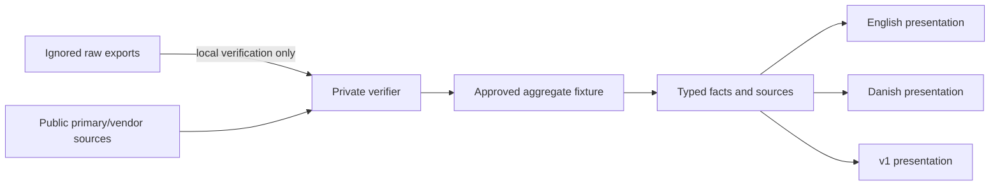

# Evidence and Privacy Boundary

My DNA Story is a public interpretation of selected ancestry evidence, not a public genome repository. The architecture must make that distinction enforceable.

The versioned evidence flow below is archived with the retired v2-v4 redesign. The active product is the original v1 route and does not ship the former typed fixture or private verifier.

## Intended Evidence Flow



The private verifier is a release tool, not a production dependency. Vercel must receive only application code, public assets, and approved aggregates.

## Proposed Public Types

```ts
type Precision = "exact" | "range" | "lessThan";
type EvidenceStatus = "verified-private" | "verified-public" | "derived" | "interpretation";

type SourceRef = {
  id: string;
  title: string;
  publisher: string;
  url?: string;
  retrievedAt?: string;
  kind: "private-export" | "vendor-method" | "vendor-tree" | "reference" | "paper";
};

type Fact<T> = {
  id: string;
  value: T;
  precision: Precision;
  status: EvidenceStatus;
  sourceIds: string[];
  asOf?: string;
  confidence?: "high" | "medium" | "low";
  methodNote?: string;
};
```

Additional records should compose facts rather than duplicate them: `OriginEstimate`, `LineageNode`, `DatasetQc`, and `Connection`.

## Publication Rules

| Data | Public? | Rule |
| --- | --- | --- |
| Approved ancestry percentages | Yes | Preserve exact/range/less-than precision and identify the vendor method. |
| Haplogroup and terminal branch | Yes | Separate base label, exact terminal placement, formation, and TMRCA. |
| Aggregate record/call/coverage counts | Yes | Reproducible locally; no row-level data. |
| Branch-defining variant summary | Yes | Summary counts and approved marker names only; retain quality caveats. |
| Tester-country counts | Yes, cautiously | Describe as self-reported origins among current testers. |
| Raw genotype/VCF/FASTA/BAM data | No | Never track, deploy, log, screenshot, or paste into the wiki. |
| Kit/account identifiers | No | Not required for the story. |
| Living match identity/contact/tree | No | Never publish without a new explicit decision and consent process. |
| Health or trait interpretation | No | Outside project scope. |

## Interpretation Ladder

The page may move from observation to explanation only if the transition is visible:

1. **Observed:** the vendor reports `<1% Baltic`.
2. **Method:** the result is a statistical fit to a reference panel.
3. **Limit:** trace estimates can change with reference panels and should not anchor genealogy.
4. **Interpretation:** it may reflect weak regional sharing or model noise.

The page must not jump from a branch date and modern tester-country cluster to a named medieval nationality, migration, or ancestor.

## Notable and Ancient Connections

- A peer-reviewed ancient genome may document that a related branch existed at a place and time. It does not make that individual a direct ancestor.
- A vendor-curated notable connection usually shares a very old node. It is an illustrative deep-line relationship, not close kinship.
- These categories must be separately labeled and filterable in v3.

## Verification Boundary

The future private verification command must:

- require the ignored local input directory and fail clearly when it is absent;
- compute only approved aggregates in memory;
- compare them to a committed sanitized fixture;
- report mismatched fact IDs without printing raw records or sequences;
- leave no tracked or deployment-bound output;
- be run on a trusted local machine before each production release.
